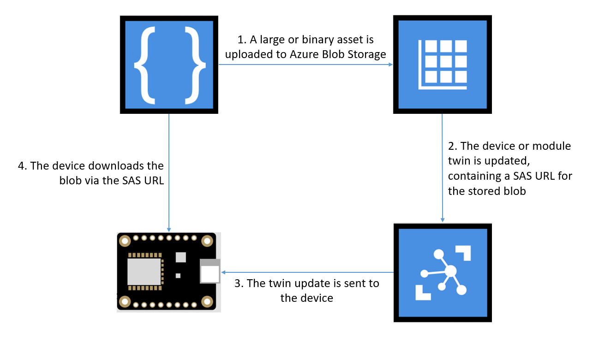

# How To Extend Azure IoT Hub Twins via Azure Blob Storage  

This sample demonstrates how to extend Azure IoT Hub Twins via Azure Blob Storage. Concretely, a solution can benefit from this approach if the twin properties either [exceed the current limit](https://feedback.azure.com/forums/907045-azure-iot-edge/suggestions/33583492-iot-hub-device-and-module-twins-limit) or refer to binary content that cannot be easily represented in the twin's JSON payload.

> NOTE: While the approach described in this repo has been used in several production scenarios, the sample code in this repo is for demonstration purposes and is not production ready. For example, the sample code does not currently include retry logic, robust error handling, tests, etc.

## Getting Started

### Prerequisites

- An Azure subscription. Get a [free trial here](https://azure.microsoft.com/en-us/free/)!

### Quickstart

- Read this README for a high level overview of the solution
- Ensure that the base infrastructure for the example has been provisioned, as described in [COMMON_SETUP.md](./COMMON_SETUP.md)
- See the README in each platform directory for further platform specific instructions.

## Problem Statement

Azure IoT Hub device twins and Azure IoT Edge module twins are limited in both size and content type. The twins are JSON payloads limited to 8kb. Members of the Azure IoT development community may wish to include twin data that exceeds the size limit. They may also wish to consume binary assets that are not easily represented in the JSON document.

## High Level Solution Overview

Conceptually, one can workaround the twin size limitation by placing the larger asset in an external store, and then delivering a reference to that store via the twin properties. Devices can still observe twin property changes, but they must retrieve the linked asset to fully process the update. 



### Twin Contract 

The structure of the twin's JSON payload represents a contract between the device client and the backend solution. In this example, we are defining the following properties in the twin.

**desired**

We will provide a reference to the blob asset through an object. The property name `configurationBlob` is arbitrary, but note the structure of the object value.

```
"properties": {
    "desired": {
        "configurationBlob": {
            "uri": "https://myaccount.blob.core.windows.net/container/blob.txt?sasquerystring",
            "ts": "2018-10-09T19:40:18.7138092Z",
            "contentType": "json"
        }
    }
}
```

Through this structure, a device or module can observe
- the location of the linked asset
- the timestamp at which the asset was last modified
- the content type of the asset; while this sample does not currently use this value, one can imagine that the device client may know how to negotiate different content types, e.g., a connected display could present an image or play a video

**reported**

We will report an acknowledgment of the new blob asset in a rich object. The property name `configurationBlob` is arbitrary, but note the structure of the object value.

```
"properties": {
    "reported": {
        "configurationBlob": {
            "uri": "https://myaccount.blob.core.windows.net/container/blob.txt?sasquerystring,
            "ts": "2018-10-09T19:40:18.7138092Z"
        }
    }
}
```

Through this structure, a device or module can report
- the location of the currently applied asset
- the timestamp of the applied asset, as echoed from the received `desired` properties

### Device Client

When the values in the twin are changed, the device client will respond to the new desired properties by retrieving the linked asset. See platform specific examples in the [dotnet](./dotnet/), [python](./python/), and [nodejs](./nodejs/) folders for more detail.

### Back-end

Consider a use case where a common large asset is meant to be applied to a class of devices. Updating all of the twins could be a tedious and error-prone process. The example workaround includes patterns for updating individual devices as well as for updating twins at scale. 

After creating or updating the blob, an automated process can submit a job through Azure IoT Hub or directly execute a device query to programatically update the twins for the targetted devices. See platform specific examples in the [dotnet](./dotnet/), [python](./python/), and [nodejs](./nodejs/) folders for more detail.

Note that the different platforms in this example repo accomplish the twin updates in different ways. This is only to demonstrate the alternative patterns. Conceptually, any of the approaches could be utilized on any supported platform.

- The [`nodejs/backend`](./nodejs/backend) folder includes a node script which uploads the blob, generates the SAS URL, and submits a job to IoT Hub to patch the twins for all devices that match a given condition. It utilizes the Node SDKs for IoT Hub and Azure Storage.
- The [`python/automate-setup`](./python/automate-setup) folder includes a bash script which uploads the blob, generates the SAS URL, and directly submits a twin update for a single device identity. It utilizes the Azure CLI.
- The [`dotnet/IoTHubExtension`](./dotnet/IoTHubExtension) folder includes C# code meant to be hosted as an Azure Function. This function, when triggered from a blob update, performs a device query against the IoT Hub device registry. For each matching device, a twin update is applied to deliver the new SAS URL.

## Resources 

For details on contributing changes and information on this project's code of conduct, please refer to the [Contributing](CONTRIBUTING.md) file.