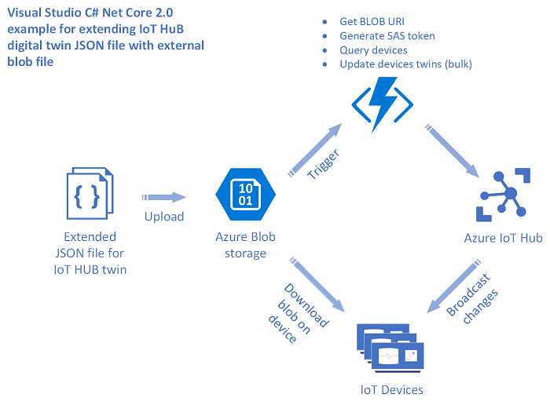

# Azure IoT Hub Large Twin Example for .NET

This sample demonstrates how to extend Azure IoT Hub Twins via Azure Blob Storage. Concretely, a solution can benefit from this approach if the twin properties either exceed the current limit or refer to binary content that cannot be easily represented in the twin's JSON payload. Here is the diagram for that sample:

## Features
This project framework provides the following features:

* Enable Device Twin and Module Tiwn to pull properties from Azure Blob Storage
* Report and download properties when the Blob is updated

## Getting Started

### Prerequisites

To run samples in this repository, you need:

- [.NET Core 2.1 SDK](https://www.microsoft.com/net/download)
- [Azure IoT Hub](https://docs.microsoft.com/en-us/azure/iot-hub/)
- [Azure Blob Storage](https://docs.microsoft.com/en-us/azure/storage/blobs/storage-quickstart-blobs-dotnet?tabs=windows)

### Quickstart

1. git clone [https://github.com/Azure-Samples/azure-iot-hub-large-twin-example.git]
2. Retrieve the device connection string for your IoT Hub device and put connection string
3. Prepare Azure Blob Storage with your data file and put Blob configuration
4. Run the program and update the blob, and you will see updated properties in Twin

