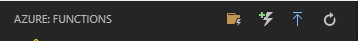
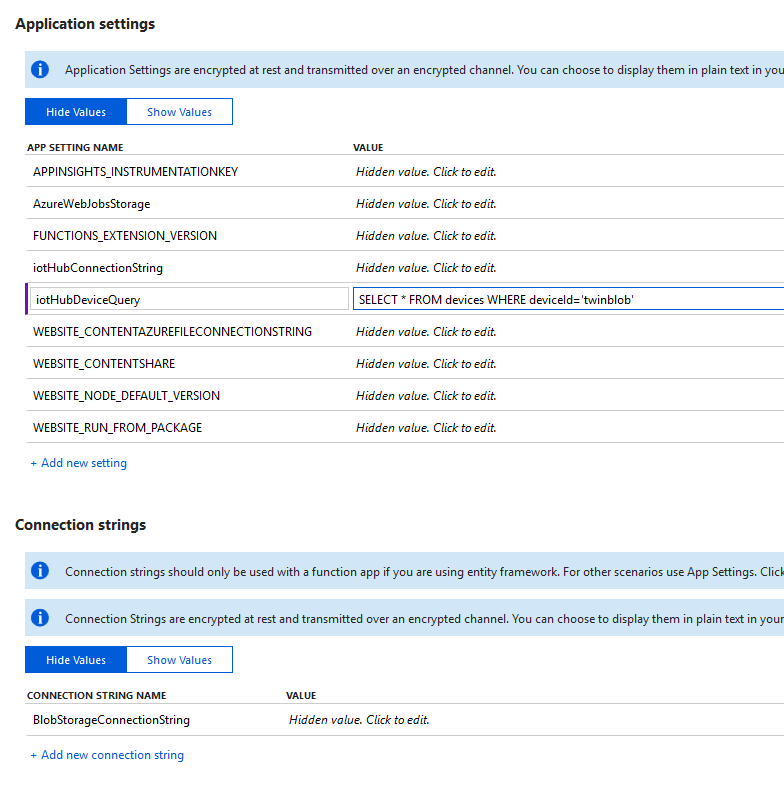
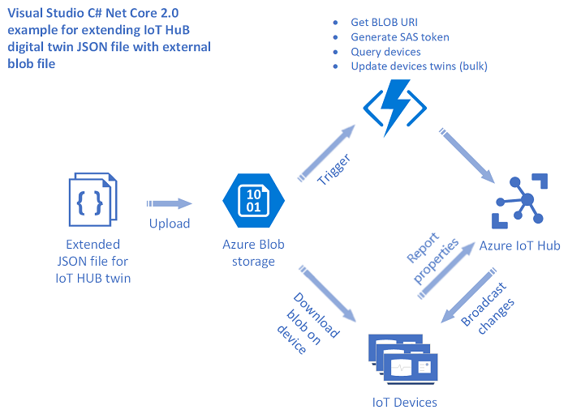

# How To Extend Azure IoT Hub Twins via Azure Blob Storage (.NET)

Please refer to the [root README](../README.md) for a high level introduction of this sample. This document covers the details of the specific `dotnet` implementation.  

## Getting Started

### Prerequisites

The [COMMON_SETUP.md](../COMMON_SETUP.md) file contains more detailed references on how to provision the required resources (e.g., IoT Hub, device identity, Storage Account, blob container).

This platform solution also requires
- [.NET Core 3.1 SDK](https://www.microsoft.com/net/download)

### Quickstart

**Start the simulated device client**

The `IoTClientDeviceBlobExtensionNetCore` project can be run as a console application which simulates a connected device.

- Retrieve the device connection string for your IoT Hub device
  - One option is to execute the following [Azure CLI](https://docs.microsoft.com/en-us/cli/azure/install-azure-cli?view=azure-cli-latest) command `az iot hub device-identity connection-string show --hub-name YourIoTHubName --device-id MyNodeDevice --output table`
  - Another option is to retrieve the connection string from the Azure Portal as described in the [Create a device identity](https://docs.microsoft.com/en-us/azure/iot-hub/iot-hub-csharp-csharp-device-management-get-started#create-a-device-identity) documentation.
- Open the `IoTClientDeviceBlobExtensionNetCore` project
  - Add the device connection string to this line in `Program.cs`: `static string DeviceConnectionString = "Put Device Connection string here";`
  - Build and run the program

At this point, your client device is connected to IoT Hub and is registered to receive updates for its associated [device twin](https://docs.microsoft.com/en-us/azure/iot-hub/iot-hub-devguide-device-twins).

**Deploy the back-end solution as an Azure Functions**

The `IoTHubExtension` project is meant to be hosted as an Azure Function. One of the easiest ways to deploy this would be:

- Open the `IoTHubExtension` project in [VS Code](https://code.visualstudio.com/download)
- Install the [Azure Functions extension](https://marketplace.visualstudio.com/items?itemName=ms-azuretools.vscode-azurefunctions) for VS Code
- Use the Azure Functions extension to create and deploy a function 

> NOTE: Be sure that you perform a `dotnet build` and `dotnet publish` before deploying the Azure Function. Also, when the VS Code Extension for Azure Functions prompts for a folder to zip and deploy, choose the publish folder (e.g.,`./bin/Debug/netcoreapp3.1/publish`) rather than the root project directory. The output should show something similar to `Syncing 1 function triggers with payload size 153 bytes successful.` The important part here is that it has synced 1 function trigger.

**Configure the Azure Function**

The Azure Function relies on one connection string, two environment variables, and the path into which blobs will be uploaded.

The environment variables and connection strings can be managed from the [Application Settings for the function app](https://docs.microsoft.com/en-us/azure/azure-functions/functions-how-to-use-azure-function-app-settings). 

- Under Connection Strings, add `BlobStorageConnectionString`, and set the value to a connection string for your storage account. You can find your storage account's connection strings in the Azure portal. Navigate to your storage account. Select `Security + networking` > `Access keys` in your storage account's menu blade to see connection strings for both primary and secondary access keys.
- Under Application Settings, add `iotHubConnectionString` and set it to an iothubowner connection string.
- Also under Application Settings, add `iotHubDeviceQuery` and set it to a value like `SELECT * FROM devices WHERE deviceId='twinblob'` where `twinblob` will be the id of your device. For more information on forming device queries, see the [Query language documentation](https://docs.microsoft.com/en-us/azure/iot-hub/iot-hub-devguide-query-language).

The path into which blobs will be uploaded is managed directly in the code. By default, the `BlobTrigger` expects the blobs to be placed within a container named `extensions`. If you wish to use a different container name, edit the following line from `BlobTriggerTwinUpdater.cs`, changing `extensions` to whatever you want the container name to be.

`public static void Run([BlobTrigger("extensions/{Uri}", Connection = "BlobStorageConnectionString")]CloudBlockBlob myBlob, string Uri, ILogger log)`

**Apply a new blob**

Create or update a blob under the storage account and path configured above. You might use [Storage Explorer](https://azure.microsoft.com/en-us/features/storage-explorer/), the [Azure Portal](https://docs.microsoft.com/en-us/azure/storage/blobs/storage-quickstart-blobs-portal), or the [Azure CLI](https://docs.microsoft.com/en-us/azure/storage/blobs/storage-quickstart-blobs-cli).

If you left the client running, you should see the new artwork displayed in the console.

## Details

### Client 

- Opens the device client connection (`DeviceClient.CreateFromConnectionString`)
- Gets the device twin (`Client.GetTwinAsync`)
- Initializes a `BlobExtension`, an abstraction provided in this project to handle each twin update and raise a secondary event after the blob asset is retrieved

The `BlobExtension` acts on the updated properties.

- Subscribes to device twin updates (`client.SetDesiredPropertyUpdateCallbackAsync`)
- When the twin is updated
  - Downloads the new blob (`DownloadTextAsync`)
  - Raises its `BlobPropertyUpdated` event with details about the new blob asset
  - Patches the twin's reported properties to acknowledge the update (`client.UpdateReportedPropertiesAsync`)

### Back-end

This example uses an Azure Function triggered from blob updates. The function iterates over the results of a device query to patch each twin. 

- The function is triggered by updates to blobs in the configured container (`BlobTrigger`)
- A new SAS URL is generated for the blob (`GetSharedAccessSignature`)
- A device query is performed against the IoT Hub device registry (`registryManager.CreateQuery`)
- For each returned device twin (`query.GetNextAsTwinAsync`), the twin's desired properties are updated with the new SAS URL (`twin.Properties.Desired = ...`)
- The patched twins are submitted back to the IoT Hub registry (`registryManager.UpdateTwins2Async`)

As alternatives, consider
- the `nodejs` example in this repo includes the upload of the blob and generation of the SAS URL. It also submits a job to IoT Hub, offloading the responsibility of applying the update to each matched twin
- the `python` example in this repo uses the Azure CLI to replace the twin for a single device by id
